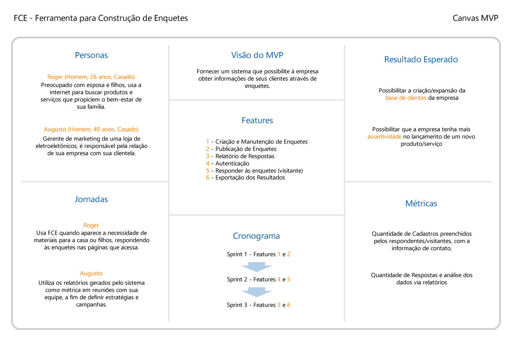

[<< Voltar](README.md)

# Canvas do Produto

Para este projeto utilizada a técnica [Lean Inception](https://www.caroli.org/lean-inception/) (desenvolvida por Paulo Caroli), o que levou à geração do Canvas MVP, apresentado a seguir:

Através deste artefato evidenciamos o propósito básico do primeiro MVP do projeto, além de outras de suas características, como:

## Público Alvo

Na seção Personas, são exemplificados os dois tipos distintos de usuários do sistema:

- Visitante: O cliente da empresa que cria suas enquetes através do FCE;
- Empresário: O empreendedor que usa os dados fornecidos pelo sistema para tomada de decisão.

Para os dois casos, são evidenciados os momentos em que o sistema mais provavelmente se encaixará em suas rotinas, através da seção Jornadas.

## Escopo

Através da análise das seções Objetivos e Métricas é possível ter uma boa ideia do escopo de atuação do sistema.

