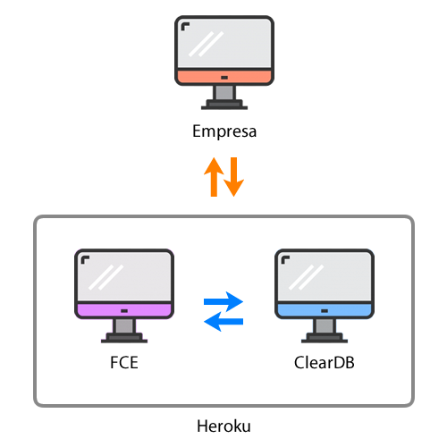
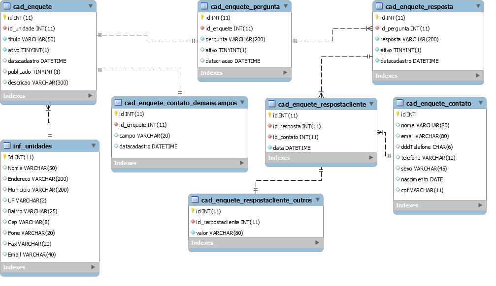

[<< Voltar](README.md)

# Representação da Arquitetura

## Modelo de Arquitetura

O FCE funciona com base na arquitetura cliente-servidor:

O sistema fica hospedado no serviço do Heroku, onde ocorre a integração com serviço ClearDB (Banco de Dados MySQL). A empresa acessa o FCE externamente, tanto pelo acesso direto no browser (para a criação das enquetes) quanto para a incorporação das mesmas no seu site.

## Modelo de Dados

A seguir o modelo ER onde é apresentada estrutura dos dados utilizados pelo sistema:

Na tabela "contato_demaiscampos" são armazenados os valores de campos extras utilizados na enquete (CPF, Sexo, Data de Nascimento).

Na tabela "respostacliente" são armazenadas as respostas a enquetes com campo aberto ("Outros").

